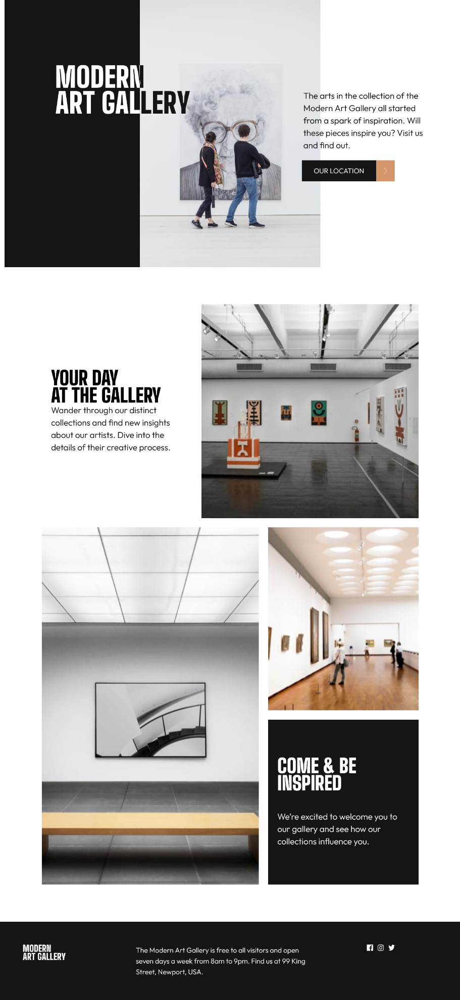
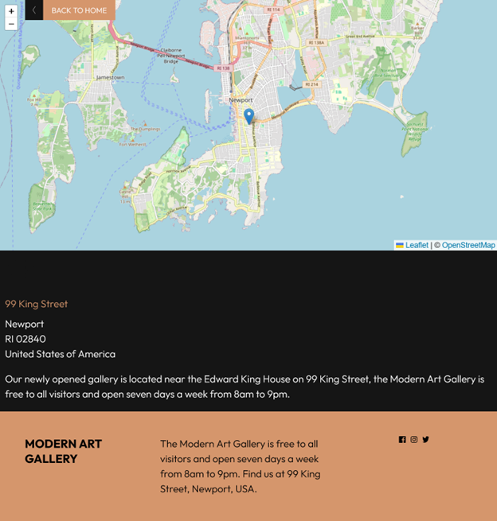
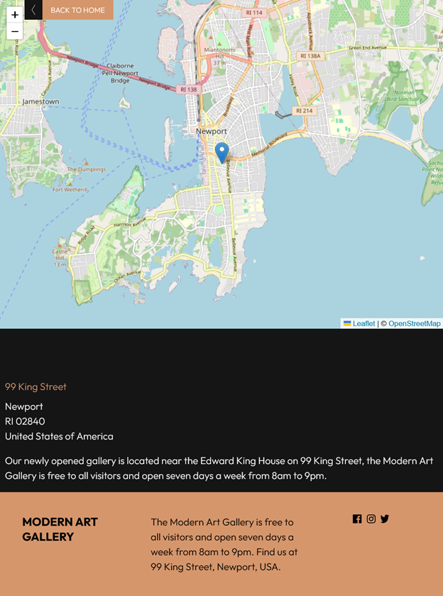
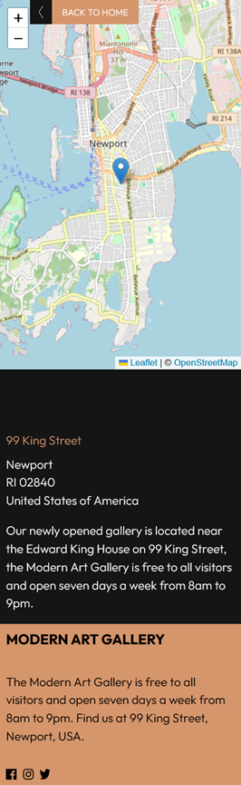

This is a solution to the [the Art gallery website coding challenge](https://www.frontendmentor.io/challenges/art-gallery-website-yVdrZlxyA). Frontend Mentor challenges help you improve your coding skills by building realistic projects. 

## Overview

### The challenge

Users should be able to:

- View the optimal layout for each page depending on their device's screen size
- See hover states for all interactive elements throughout the site
- Use [Leaflet JS](https://leafletjs.com/) to view the map around the gallery.

### Screenshot

#### Main

#### Map

### Links

- Solution URL: [https://github.com/toshirokubota/art-gallery-website](https://github.com/toshirokubota/art-gallery-website)
- Live Site URL: [https://toshirokubota.github.io/art-gallery-website/](https://toshirokubota.github.io/art-gallery-website/)

## My process

### Built with

- Semantic HTML5 markup
- CSS custom properties
- Flexbox
- CSS Grid
- Mobile-first workflow
- Leaflet.js

### What I learned

I was able to incorporate leaflet.js into the design.

I was able to design a layout with overlapping logos so that it gives an 
appearance of changing the color depending on the background.

### Continued development

I continue working on layouts with grid and flexbox. I feel that I am becoming
more comfortable but there are still many options that I am not familiar with.

